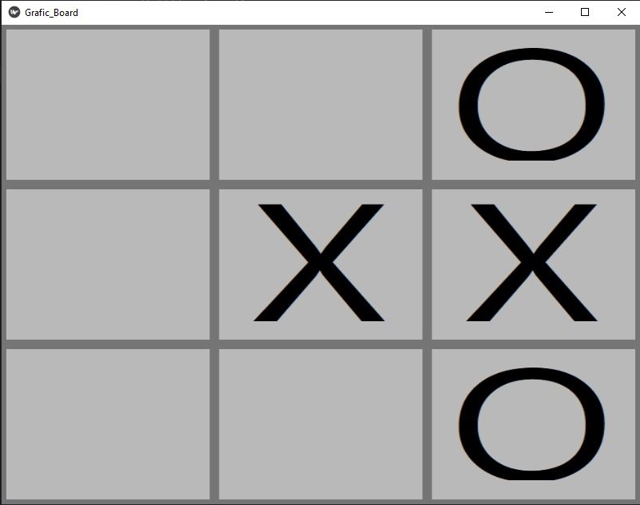
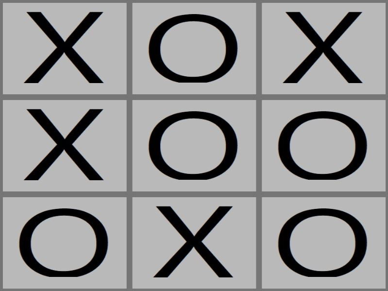

# Tic-Tac-Toe

## Description
This program plays a game of tic-tac-toe against a user. The file "build_dict.py" builds 
a dictionary by playing many random games and adding their boards to the dictionary. The 
boards are added to the dictionary in a string format that uses less memory and makes the
search in the dictionary faster. Each board is given a score based on RL method of operant 
conditioning - positive strengthening of the score if the game was won, lower positive
strengthening for draw and negative
strengthening if the game was lost. The file "tic_tac_toe.py" then uses this dictionary 
in order to play the game with kivy based GUI. For each turn of the computer, the program
searches for all the possible moves and picks the one with the highest score.


## Usage
1. Run "tic_tac_toe.py" file.

2. You have the first turn of the game, press on one of the squares in order to place your tool there.
You play with the cirle tools and the computer plays with the X tools.

<p align="center">
  
</p>

3. Wait for the computer to play his turn, then continue playing.


<p align="center">
  
</p>

## Requirements
1. 
```bash
pip install -r requirments.txt
```
